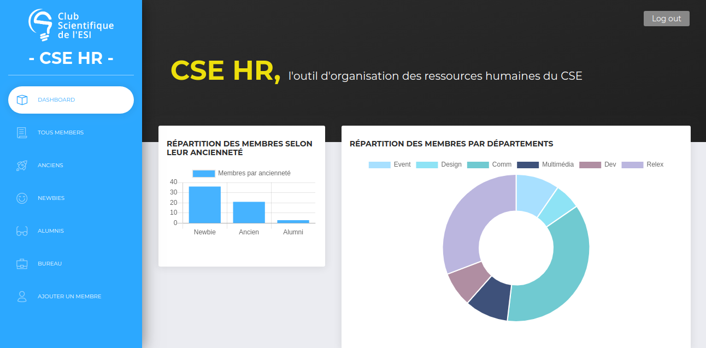
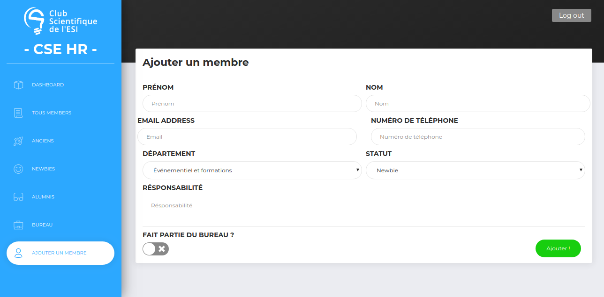
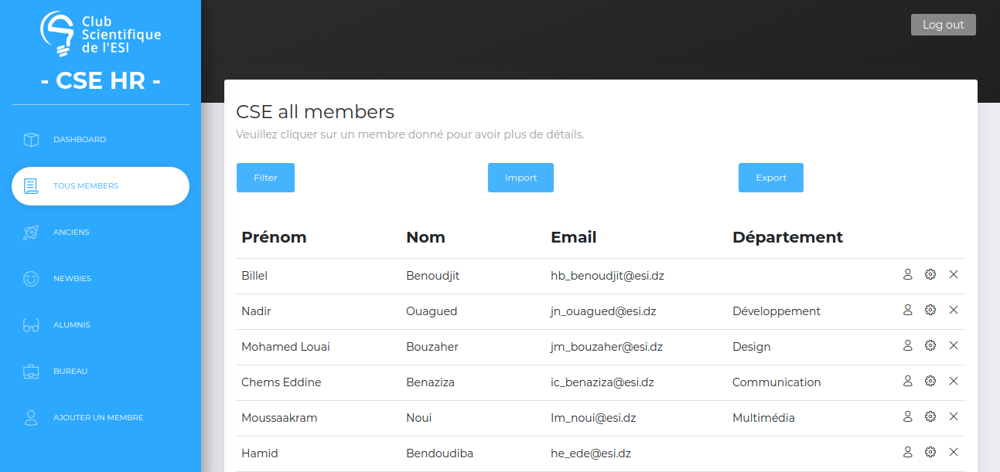
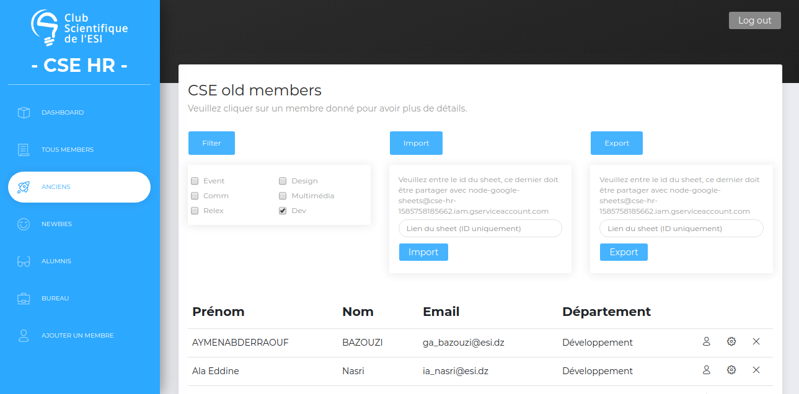

# [Now UI Dashboard React](https://demos.creative-tim.com/now-ui-dashboard-react/#/dashboard) [](https://twitter.com/intent/tweet?url=https%3A%2F%2Fdemos.creative-tim.com%2Fnow-ui-dashboard-react%2F%23%2Fdashboard&text=Now%20UI%20Dashboard%20React%20by%20Creative%20Tim%20%7C%20Free%20React%20Admin%20Template&original_referer=http%3A%2F%2Flocalhost%3A3000%2Fdashboard&via=creativetim&hashtags=react%2Cbootstrap)


  []() []() [](https://discord.gg/E4aHAQy)


**[CSE HR](https://demos.creative-tim.com/now-ui-dashboard-react/#/admin/dashboard)** is an admin dashboard designed to be beautiful and simple. It is built on top of [Reactstrap](https://reactstrap.github.io/) and [React](https://reactjs.org/) ([create-react-app](https://github.com/facebook/create-react-app)), using [Now UI Dashboard](https://www.creative-tim.com/product/now-ui-dashboard) and it is fully responsive.

This project was designed to manage the human resources of the CSE Scientific Club of the ESI, it allows to have statistics compared to the number of members by departments and by year, it also allows to display the different lists of members by department (Filter) and annciénté as well as the personal information of each member which can be changed or deleted at any time. Regarding the addition, we can either add the members manually or add them using the import of a google sheet, same for the data recovery using export which transmits the data to a google sheet.

## Table of Contents

* [Demo](#demo)
* [Quick Start](#quick-start)
* [Documentation](#documentation)
* [File Structure](#file-structure)

## Demo

| Dashboard | 
| [] |
| Add members | 
| [] |
| Tables |  
| [] |
|Import/Export/Filter Data | 
| [] |

## Quick start

Quick start options:

- Clone the repo: `git clone https://github.com/BillelBenoudjit/CSE_HR.git`.
- [Download from Github](https://github.com/BillelBenoudjit/CSE_HR).


## Documentation
The documentation for the Now UI Dashboard React is hosted at our [website](https://demos.creative-tim.com/now-ui-dashboard-react/#/documentation/tutorial).


## File Structure

Within the download you'll find the following directories and files:

```
CSE HR
├── CHANGELOG.md
├── Documentation
│   └── tutorial-components.html
├── LICENSE.md
├── README.md
├── package.json
├── public
│   ├── apple-icon.png
│   ├── favicon.ico
│   ├── index.html
│   └── manifest.json
└── src
    ├──api
    |   ├── api.js
    ├── assets
    │   ├── css
    │   │   └── demo.css
    │   ├── fonts
    │   │   └── ...
    │   ├── img
    │   │   ├── flags
    │   │   │   └── ...
    │   │   └── ...
    │   └── sass
    │       ├── now-ui-dashboard
    │       │   ├── mixins
    │       │   │   └── ...
    │       │   ├── plugins
    │       │   │   └── ...
    │       │   └── ...
    │       └── now-ui-dashboard.scss
    ├── components
    │   ├── BarChart
    │   │   └── BarChart.jsx
    |   ├──DoughnutChart
    |   |   └── DoughnutChart.jsx
    │   ├── FixedPlugin
    │   │   └── FixedPlugin.jsx
    │   ├── Footer
    │   │   └── Footer.jsx
    │   ├── Navbars
    │   │   └── DemoNavbar.jsx
    │   ├── PanelHedear
    │   │   └── PanelHeader.jsx
    │   └── Sidebar
    │       └── Sidebar.jsx
    |
    ├── App.js
    ├── index.js
    ├── routes.js
    ├── PrivateRoute.js
    |
    ├── variables
    │   └── icons.jsx
    └── views
        ├── Dashboard
        │   └── Dashboard.jsx
        ├── TableList
        │   └── TableList.jsx
        ├── TableListAlumnis
        │   └── TableListAlumnis.jsx
        ├── TableListAnciens
        │   └── TableListAnciens.jsx
        ├── TableListBureau
        │   └── TableListBureau.jsx
        ├── TableListNewbies
        │   └── TableListeNewbies.jsx
        └── UserPage
            └── UserPage.jsx
```